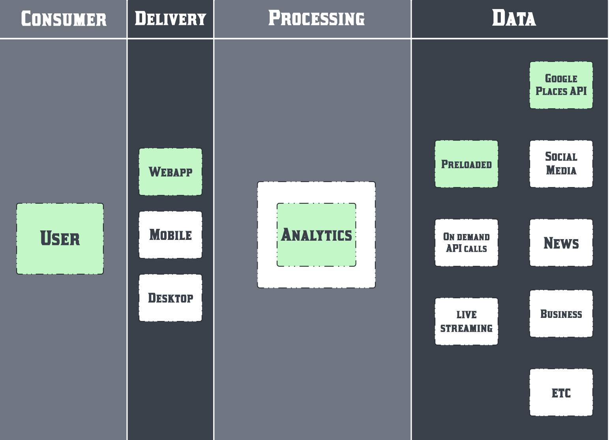

### Your 🦅 data exporer
# FalconsEyeView by thefalconian team 
Submission* for the Falcon Hackathon organized by AI71 and LABLAB.AI

**Should be one, didnt submit.*

## Business value

### With FalconsEyeView consumers, data analysts, product managers, owners can answer questions like:
## Why? How?
With natural language processing and the power of foundational models like Falcon

## How many? How much? 
With quantitative data and visualizations

### For example:

#### Customer satisfaction
- What is the most favourite aspect of experiance? 
#### Product/Service impovements 
- What features or improvements could be added?
#### Business planning - 
- Develop a perfect business concept based on market feedback.
- Create an ideal business model using customer insights.

### What has been done for the 🦅 proof of concept



## Pricing Concept

### Free 
Minimal features, data sources and requests quota
### Pro $
More features, integrations and requests
### Enterprise $$
Custom tailored solutions


### To run the POC webapp:

Set .env file with environment variables
```
#for embeddings
TOGETHER_API_KEY=

#for falcon
AI71_API_KEY=

#for jupyter notebook to get datasets
GOOGLE_MAPS_API_KEY=
```
Create and activate virtual environment.

Install required packages with:
```
pip install -r requirements.txt
```
Use jupyter notebook to get datasets.

For streamlit web app to run locally:
```
streamlit run app.py
```

